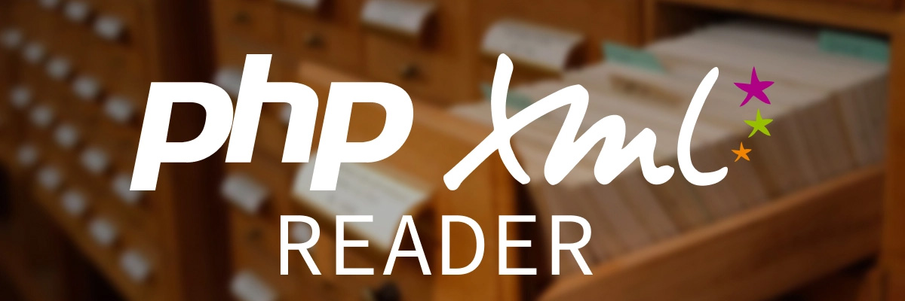

# PHP XML Reader



[![php][php-version-src]][php-version-href]
[![version][version-src]][version-href]
[![downloads][downloads-src]][downloads-href]
[![license][license-src]][license-href]
[![tests][tests-src]][tests-href]
[![codecov][codecov-src]][codecov-href]

PHP package to read XML with nice API, heavily inspired by [`stackoverflow answer`](https://stackoverflow.com/a/46349713/11008206).

## About

PHP have native functions to read XML files with [`SimpleXML`](https://www.php.net/manual/en/book.simplexml.php), but it's not easy to use and not very flexible. This package offer to read XML files as array, with a simple and flexible API.

## Requirements

-   **PHP version** >= _8.0_

## Installation

You can install the package via composer:

```bash
composer require kiwilan/php-xml-reader
```

## Usage

// TODO

## Testing

```bash
composer test
```

## Changelog

Please see [CHANGELOG](CHANGELOG.md) for more information on what has changed recently.

## Credits

-   [`spatie`](https://github.com/spatie) for `spatie/package-skeleton-php`

## License

The MIT License (MIT). Please see [License File](LICENSE.md) for more information.

[](https://github.com/kiwilan)

[version-src]: https://img.shields.io/packagist/v/kiwilan/php-xml-reader.svg?style=flat-square&colorA=18181B&colorB=777BB4
[version-href]: https://packagist.org/packages/kiwilan/php-xml-reader
[php-version-src]: https://img.shields.io/static/v1?style=flat-square&label=PHP&message=v8.1&color=777BB4&logo=php&logoColor=ffffff&labelColor=18181b
[php-version-href]: https://www.php.net/
[downloads-src]: https://img.shields.io/packagist/dt/kiwilan/php-xml-reader.svg?style=flat-square&colorA=18181B&colorB=777BB4
[downloads-href]: https://packagist.org/packages/kiwilan/php-xml-reader
[license-src]: https://img.shields.io/github/license/kiwilan/php-xml-reader.svg?style=flat-square&colorA=18181B&colorB=777BB4
[license-href]: https://github.com/kiwilan/php-xml-reader/blob/main/README.md
[tests-src]: https://img.shields.io/github/actions/workflow/status/kiwilan/php-xml-reader/run-tests.yml?branch=main&label=tests&style=flat-square&colorA=18181B
[tests-href]: https://packagist.org/packages/kiwilan/php-xml-reader
[codecov-src]: https://codecov.io/gh/kiwilan/php-xml-reader/branch/main/graph/badge.svg?token=P9XIK2KV9G
[codecov-href]: https://codecov.io/gh/kiwilan/php-xml-reader
